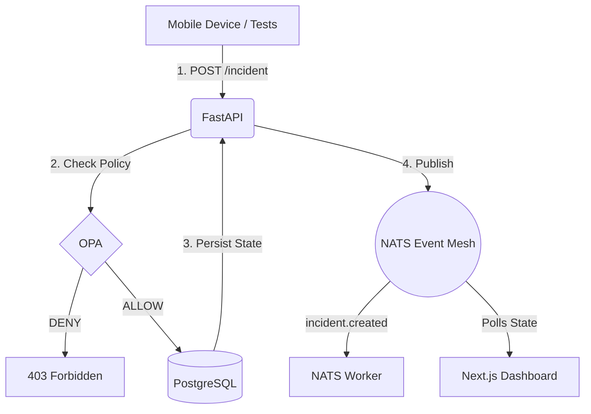

# ORION (Planetary Emergency Response Network)

> "Don't build the ecosystem first. Build the nervous system first."

ORION is a highly resilient, zero-trust, event-driven mesh designed to coordinate emergency response at a planetary scale. It operates under the assumption that networks will fail, satellites will drop, and AI agents will hallucinate. 

This repository contains **ORION V0.1** — the foundational "reflex" loop demonstrating the core architecture.

---

## 🏗️ The V0.1 Architecture

ORION abandons traditional monolithic REST architectures in favor of an asynchronous, offline-first event mesh.



### Core Technologies
*   **Identity:** Keycloak (Federated Identity / SPIFFE for edge)
*   **Authorization:** Open Policy Agent (OPA) — Deterministic, decoupled policy firewall.
*   **State:** PostgreSQL (Relational truth and idempotency cache).
*   **Event Mesh:** NATS (Global routing via Superclusters, offline resilience via Leaf Nodes).
*   **Satellite Links:** 3GPP Non-Terrestrial Networks (NTN) transparent integration.

---

## 🚀 Running ORION Locally (V0.1)

You need **Docker** and **Python 3.10+**.

### 1. Stand up the Infrastructure
Boot the NATS broker, PostgreSQL database, OPA policy engine, and Keycloak.
```bash
docker-compose up -d
```
*(Note: OPA will automatically mount the rules from `policy/opa/policy.rego`)*

### 2. Start the API
The API acts as the gateway to the event mesh.
```bash
cd apps/api
pip install -r requirements.txt
uvicorn main:app --reload --port 8000
```

### 3. Start the Next.js Dashboard
The operator dashboard to view real-time incidents.
```bash
cd apps/dashboard
npm install
npm run dev
```

### 4. Fire the End-to-End Test
In a new terminal window, simulate a citizen triggering an SOS and a malicious actor trying to hit the admin endpoints.
```bash
cd tests
python e2e_test.py
```

Watch the dashboard at `http://localhost:3000`. You will see the incident propagate instantly.

---

## 🛡️ Design Principles

1.  **Bounded Autonomy:** AI agents do not have credentials to mutate state. They propose actions (JSON) which are deterministically validated by OPA before execution. If the blast radius is too high, it escalates to a human.
2.  **Idempotency by Default:** Satellite (NTN) links will drop. Every client operation includes an `Idempotency-Key` validated at the API layer, and every NATS worker performs consumer-side deduplication.
3.  **Offline Survival (Nested Trust):** NATS Leaf nodes queue telemetry locally when offline. Edge SPIRE servers rotate credentials locally. The edge must survive when the cloud vanishes.

---

## 📚 Deep Research Docs

If you are joining the team, read the architectural research documents located in `docs/architecture/`:
*   [Scaling NATS & NTN Satellites](docs/architecture/ORION_NATS_NTN_Research.md)
*   [AI Security & Bounded Autonomy](docs/architecture/ORION_AI_Security_Bounded_Autonomy.md)
*   [Digital Twin & Chaos Engineering](docs/architecture/ORION_Digital_Twin_Chaos_Engineering.md)
*   [Zero Trust at the Disconnected Edge](docs/architecture/ORION_Zero_Trust_Disconnected_Edge.md)