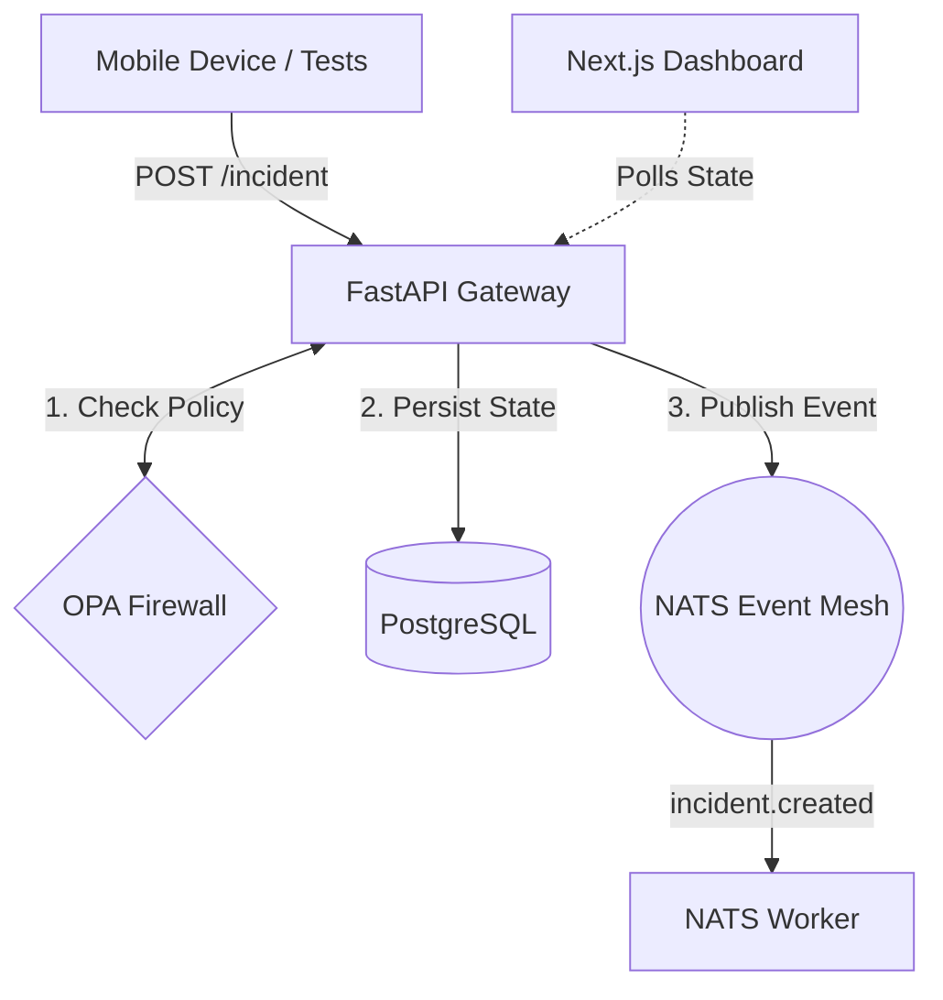

# ORION: Planetary Emergency Response Network

> "Don't build the ecosystem first. Build the nervous system first."

ORION is a highly resilient, zero-trust, event-driven mesh designed to coordinate emergency response at a planetary scale. It operates under the hard assumption that networks will fail, satellites will drop, and AI agents will hallucinate. 

This repository contains **ORION V0.1** — the foundational "reflex" loop demonstrating the core architecture. It proves that an authenticated device can submit an SOS, have it independently authorized, persisted, and broadcast globally, even in degraded conditions.

---

## 🏗️ The V0.1 Architecture

ORION abandons traditional monolithic REST architectures in favor of an asynchronous, offline-first event mesh.



### The Component Breakdown

*   **Identity (Keycloak - Pending):** Manages users (citizens vs. operators). In edge environments, this will sync with SPIFFE/SPIRE for local, offline credentials.
*   **Authorization (Open Policy Agent - OPA):** A standalone decision engine. The API does not decide if you are allowed to act; it asks OPA. This decoupling is critical for "Bounded Autonomy" when AI agents are introduced.
*   **State (PostgreSQL):** The source of truth for the incident and the idempotency cache. If a client retries a request, Postgres catches the duplicate `Idempotency-Key` and short-circuits the logic.
*   **Event Mesh (NATS):** The backbone. We chose NATS over Kafka or RabbitMQ because NATS supports **Leaf Nodes** (for offline edge sync) and **Superclusters** (for global, low-latency routing without massive overhead).
*   **Satellite Links (3GPP NTN):** While not explicitly coded in V0.1, the architecture assumes connections run over Non-Terrestrial Networks. This means extreme latency and frequent drops, handled by our idempotency and NATS edge queuing.

---

## 📂 Repository Structure Explained

```text
orion/
├── apps/
│   ├── api/          # FastAPI Gateway. Receives traffic, talks to OPA, writes to DB/NATS.
│   └── dashboard/    # Next.js Operator Dashboard. Polls the API to visualize the mesh.
├── docs/
│   └── architecture/ # Deep research files imported from the project's Obsidian Vault.
├── infra/
│   └── docker/       # Infrastructure init scripts (e.g., PostgreSQL table creation).
├── policy/
│   └── opa/          # Rego policy files. This is the ultimate law of the system.
├── services/
│   └── worker/       # Python NATS consumer. Listens for events and executes async logic.
├── tests/
│   └── e2e_test.py   # Simulates a mobile client sending an SOS and attempting unauthorized access.
└── docker-compose.yml # The zero-fluff local development environment.
```

---

## 🔄 The Lifecycle of an SOS (How it actually works)

When you trigger the system, here is exactly what happens under the hood:

1.  **The Trigger:** A user (or the `e2e_test.py` script) fires a `POST /v1/incidents` payload to the FastAPI gateway. It includes a unique `Idempotency-Key` in the header.
2.  **The Firewall Check:** The API pauses and sends the user's role and requested action to the OPA container. OPA evaluates `policy.rego`. If you are a citizen trying to access an operator dashboard, OPA returns `DENY` (HTTP 403). If it's a valid SOS, OPA returns `ALLOW`.
3.  **The Idempotency Check:** The API checks PostgreSQL. Have we seen this `Idempotency-Key` before? If yes, it means the client's network dropped and they retried. The API instantly returns the cached response without duplicating the emergency.
4.  **State Mutation:** The API writes the new incident to PostgreSQL.
5.  **The Broadcast:** The API publishes an `incident.created` event payload to the NATS broker.
6.  **The Worker Reaction:** The NATS Worker, constantly listening, receives the event. It performs a *consumer-side* idempotency check, logs the incident, and begins processing (e.g., AI routing, alerting).
7.  **The Dashboard Update:** The Next.js dashboard, sitting on an operator's screen, polls the API and instantly visualizes the new emergency.

---

## 🚀 Running ORION Locally

You need **Docker** and **Python 3.10+**.

### 1. Stand up the Infrastructure
Boot the NATS broker, PostgreSQL database, and OPA policy engine.
```bash
docker-compose up -d
```
*(Note: OPA will automatically mount the rules from `policy/opa/policy.rego`)*

### 2. Start the API
The API acts as the gateway to the event mesh.
```bash
cd apps/api
pip install -r requirements.txt
uvicorn main:app --reload --port 8000
```

### 3. Start the Next.js Dashboard
The operator dashboard to view real-time incidents.
```bash
cd apps/dashboard
npm install
npm run dev
```

### 4. Start the Worker (Optional but recommended)
```bash
cd services/worker
pip install nats-py
python main.py
```

### 5. Fire the End-to-End Test
In a new terminal window, simulate a citizen triggering an SOS and a malicious actor trying to hit the admin endpoints.
```bash
cd tests
pip install httpx
python e2e_test.py
```

Watch the dashboard at `http://localhost:3000`. You will see the incident propagate instantly.

---

## 🛡️ Future Design Principles

As we scale V0.1 to V1.0, the following rules remain absolute:

1.  **Bounded Autonomy:** AI agents will eventually route these incidents. They will *never* have direct API write access. They will propose JSON actions, which OPA will evaluate. If an AI hallucinates or suffers Prompt Injection, OPA will block the action.
2.  **Edge Survival:** We do not build for the cloud; we build for the edge. When a disaster severs the fiber line, the local NATS Leaf node and local SPIRE identity server must keep the local responder network alive.

---

## 📚 Deep Research Docs

If you are joining the team, you **must** read the architectural research documents located in `docs/architecture/` before pushing code:
*   [Scaling NATS & NTN Satellites](docs/architecture/ORION_NATS_NTN_Research.md)
*   [AI Security & Bounded Autonomy](docs/architecture/ORION_AI_Security_Bounded_Autonomy.md)
*   [Digital Twin & Chaos Engineering](docs/architecture/ORION_Digital_Twin_Chaos_Engineering.md)
*   [Zero Trust at the Disconnected Edge](docs/architecture/ORION_Zero_Trust_Disconnected_Edge.md)