# ORION

**[Artificial Civilization Intelligence (ACI) Research Platform](https://github.com/Team-Auralis/orion)**

[](https://github.com/Team-Auralis/orion/graphs/contributors)
[](https://github.com/Team-Auralis/orion/network/members)
[](https://github.com/Team-Auralis/orion/stargazers)
[](https://github.com/Team-Auralis/orion/issues)
[](https://github.com/Team-Auralis/orion/blob/main/LICENSE)
[](https://twitter.com/TeamAuralis)

<div align="center">
<h3>ORION</h3>
<p>Artificial Civilization Intelligence (ACI) Research Platform</p>
<p><em>Research platform for studying civilization-scale machine intelligence — an experimental framework in development toward the proposed ACI architecture.</em></p>
</div>

<div id="readme-top"></a>

---

## Architecture

```mermaid
graph TD
    %% Nodes
    nginx[Tls Frontier: Nginx]:::nginx
    api[orion-api: FastAPI]:::api
    worker[orion-worker]:::worker
    sentinel[orion-sentinel]:::sentinel
    aegis[orion-aegis]:::aegis
    postgres[PostgreSQL]:::db
    redis[Redis]:::db
    nats[NATS JetStream]:::bus
    keycloak[Keycloak]:::auth
    opa[OPA Policy]:::policy
    governance[Governance Layer]:::gov

    %% Edges
    nginx -->|HTTPS, rate-limited| api
    api -->|incidents, telemetry| worker
    api -->|HITL recommendations| sentinel
    worker -->|NATS events, JetStream| nats
    sentinel -->|AI triage| api
    aegis -->|edge ingress, SOS| api
    api -->|queries, writes| postgres
    api -->|cached reads| redis
    api -->|auth, profile| keycloak
    api -->|policy decisions| opa
    governance -->|HITL approval| aegis
    governance -->|OPA policies| opa

    %% Styles
    classDef nginx fill:#ff6b6b,stroke:#444,stroke-width:2px;
    classDef api fill:#ffa502,stroke:#444,stroke-width:2px;
    classDef worker fill:#4ecdc4,stroke:#444,stroke-width:2px;
    classDef sentinel fill:#ffe66d,stroke:#444,stroke-width:2px;
    classDef aegis fill:#ffe66d,stroke:#444,stroke-width:2px;
    classDef db fill:#141414,stroke:#444,stroke-width:2px;
    classDef bus fill:#73d2de,stroke:#444,stroke-width:2px;
    classDef auth fill:#9a9a9a,stroke:#444,stroke-width:2px;
    classDef policy fill:#706fd3,stroke:#444,stroke-width:2px;
    classDef gov fill:#d3b6e9,stroke:#444,stroke-width:2px;
```



### Core Pillars

| Module | Role |
|--------|------|
| **AURA** | Multimodal intelligence and reasoning core (relational state abstraction, game-lab transfer studies). |
| **OMNIS** | Continuously updateable civilization world model — entities, relationships, causality (`modules/cic`, `services/omnis`). |
| **NEXUS** | Multi-agent intelligence fabric for coordination, dispute resolution, and aggregation. |
| **FORGE** | Scientific discovery and hypothesis generation; verifies any high-stakes recommendation. |
| **ASCEND** | Long-horizon planner (days to decades) with uncertainty handling and replanning. |
| **VEIL / SHIELD / OPA** | Governance + security layer that gates all real-world interaction. |

### Services in this Repository

| Service | Path | What it does |
|---------|------|--------------|
| `orion-api` | `apps/api/main.py` | FastAPI gateway: incidents, `/v1/haven/sos`, telemetry compression, pilot suspend/resume, dispatch recommendations with human-in-the-loop, JWT auth via Keycloak JWKS. |
| `orion-worker` | `services/worker/main.py` | NATS/JetStream consumer (`incident.*`), idempotency dedup, geospatial dispatch, outbox publishing with timeout protection. |
| `orion-sentinel` | `services/ai_sentinel/main.py` | AI triage on JetStream with deterministic fallback; second-opinion math review (Mathstral via Ollama). |
| `orion-aegis` | `services/aegis/main.py` | Edge/communications gateway: validated device ingress, SOS decoding, channel management. |
| **NECTAR** | `services/nectar/` | Fruit-fly mushroom-body learning experiments (KC→MBON plasticity, Brian2 connectome simulation, reproducible RNG + stable tokenizer). |
| **CIC** | `modules/cic`, `services/cic/` | Continuity/consistency auditing: cosine-drift detection with clamped `[0,1]` scores, composite drift, policy-aware recommendations. |
| **OMNIS** | `services/omnis/` | World-model evidence ingestion + `TransferGuard` (physical-action transfers require FORGE verification regardless of confidence). |
| **FORGE CYBER** | `services/cyber/` | Normalized security event schema (OSES), SOAR response engine (policy-gated, human-approved, audited), event emitter. |
| **Mathsage** | `services/mathsage/` | LLM-backed math coprocessor used as a non-blocking second opinion in FORGE review. |

### Support Services (Docker Compose)

`postgres`, `redis` (password-protected), `keycloak` (OIDC), `opa` (policy), `nats` (auth'd event bus), `prometheus`, `grafana`, `jaeger` (traces), plus `orion-dashboard` (Next.js).

### Getting Started

1. **Clone & install**

   ```bash
   git clone https://github.com/Team-Auralis/orion.git
   cd orion
   ```

2. **Configure environment**

   ```bash
   cp .env.example .env
   # Replace every CHANGE_ME_* value with a strong random secret:
   #   python -c "import secrets; print(secrets.token_urlsafe(32))"
   ```
   `.env` is gitignored — never commit real credentials. Tests and CI rely on `REDIS_URL`.

3. **Start the stack**

   ```bash
   docker-compose up -d --build
   # Everything terminates at https://localhost:443 (Nginx); internal ports are locked down.
   ```

4. **Run the test suite** (Redis must be reachable — use the `REDIS_URL` from your `.env`):

   ```bash
   pip install -r requirements.txt -r requirements-dev.txt
   $env:REDIS_URL = "redis://:<password>@localhost:6379/0"   # PowerShell
   pytest
   ```

### Key Endpoints

| Method | Path | Auth | Purpose |
|--------|------|------|---------|
| POST | `/v1/incidents` | JWT | Create incident; triggers dispatch pipeline. |
| POST | `/v1/haven/sos` | public¹ | Civilian SOS ingestion (validated). |
| POST | `/v1/auth/break-glass` | public¹ | Emergency access (audited; JWT issued). |
| POST | `/v1/telemetry/compress` | public¹ | Lossy quaternary/ternary packing + sensor consistency gating (rate-limited and input-capped). |
| GET | `/v1/pilot/status`, POST `/v1/pilot/suspend`/`resume` | JWT+admin | AI pilot kill-switch. |
| GET | `/v1/dispatch/recommendations` | JWT | HITL dispatch recommendations. |
| GET | `/v1/ai/health` | JWT | Ollama/AI-stack health. |

¹ Public endpoints are defense-in-depth: rate-limited via slowapi, bounded input sizes, and validation at the model boundary.

### Security Model

- **Authentication:** RS256 JWTs from Keycloak, verified against the realm JWKS by `kid` — forged/expired/unknown-key tokens are rejected (see `tests/test_jwt_verification.py`).
- **Rate limiting / spoofing:** `X-Real-IP` is only trusted from known proxy peers (`TRUSTED_PROXY_IPS`); the rate limiter can't be gamed with a spoofed header.
- **Secrets hygiene:** `.env`, private keys, DB files, and model weights are gitignored and dockerignored; compose wires secrets via `${REDIS_PASSWORD}` etc., never literals.
- **Governance / HITL:** physical-action transfers must pass FORGE verification (`services/omnis/transfer_guard.py`); SOAR responses require human approval for high-impact actions; self-approval, non-human approvers, stale/future approvals are all rejected.
- **Input validation:** pydantic caps (e.g. `states` ≤ 100k, `readings` ≤ 10k) prevent unbounded payload DoS on unauthenticated paths.
- **Data integrity:** worker dedup fails open (a Redis outage can't silently drop events); JetStream uses correct ack/nak semantics with `nak(delay=5)` on transient errors; outbox publishes time out instead of wedging the loop.

### Testing

- **Suite:** `pytest` (169+ tests) — see `pytest.ini` / `requirements-dev.txt`.
- **Coverage highlights:** JWT verification, secrets hygiene (`test_no_secrets.py`), JetStream/ack semantics, outbox chaos, rate-limit spoofing, transfer-guard policy, CIC drift, NECTAR tokenizer determinism, flymemory vectorization, SOAR approval flows.
- **CI:** `.github/workflows/ci.yml` runs the suite; `strix-security.yml` runs an external agentic pentest over `apps/api` and `services/worker`.

### Repository Layout

```mermaid
graph TD
    apps[apps/]:::apps
    services[services/]:::services
    modules[modules/]:::modules
    scripts[scripts/]:::scripts
    tests[tests/]:::tests
    infra[infra/]:::infra
    docs[docs/]:::docs
    contracts[contracts/]:::contracts
    policy[policy/]:::policy
    forge[forge/]:::forge

    direction TB

    classDef apps fill:#ff6b6b;
    classDef services fill:#4ecdc4;
    classDef modules fill:#ffe66d;
    classDef scripts fill:#73d2de;
    classDef tests fill:#706fd3;
    classDef infra fill:#141414;
    classDef docs fill:#d3b6e9;
    classDef contracts fill:#9a9a9a;
    classDef policy fill:#706fd3;
    classDef forge fill:#ffa502;
```



```
apps/api          FastAPI gateway (routes, auth, telemetry, pilot, dispatch)
apps/dashboard    Next.js dashboard
apps/mobile       Mobile app
services/         Worker, sentinel, aegis, nectar, cic, omnis, cyber, forge, nexus, ascend...
modules/          Reusable research modules (CIC layers, game-lab, orbital-view)
scripts/          Training, evaluation, hardening and audit tooling
tests/            pytest suite
infra/            Compose, Nginx, Keycloak realm, certs (public only)
docs/             ACI architecture documentation suite
contracts/        Interface/protocol contracts
policy/           Governance policies (OPA)
forge/            FORGE experiment artifacts
```

### Experimental Status

- Portions of the platform are pipelines and scaffolding around the research subsystems; the most actively developed research areas are **NECTAR** (connectome learning with reproducible seeds) and **game-lab** (transfer learning under controlled comparisons).
- Transfer experiments report *whatever the evidence shows* — e.g. matched hyperparameters removed a learning-rate confound and the claimed transfer advantage honestly disappeared under several seeds.
- Model checkpoints and trained artifacts are **not** distributed in this repository.

### License

See `THIRD_PARTY.md` and the repository copyright header. All rights reserved.

---

<div id="readme-bottom"></a>

<a href="#readme-top">Back to top</a>

---

### Changelog

#### Unreleased

- Added professional README with mermaid diagrams and badge shields
- Restructured architecture section with interactive graph diagrams
- Updated key endpoints table with public endpoint footnotes
- Added governance/HITL section with detailed policy descriptions
- Expanded testing section with coverage highlights
- Added repository layout mermaid diagram

---

### Contact

- **Twitter:** [@TeamAuralis](https://twitter.com/TeamAuralis)
- **Email:** contact@auralis.team (replace with actual)
- **GitHub:** [Team-Auralis/orion](https://github.com/Team-Auralis/orion)