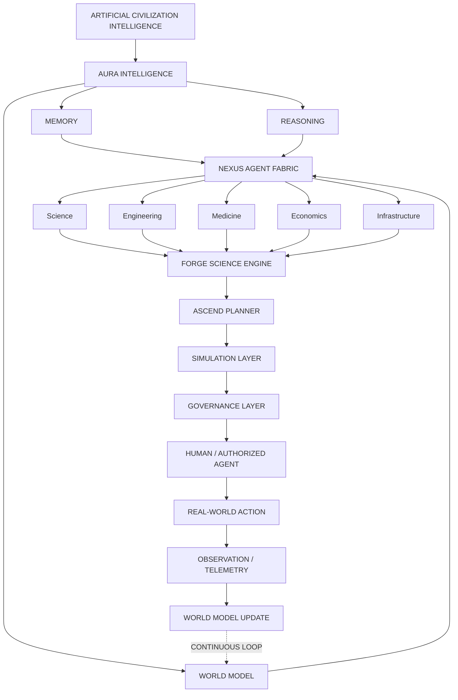

# ORION

#module #project

> **ORION** is an architecture being developed toward the proposed [[ACI Definition|Artificial Civilization Intelligence (ACI)]] framework. It has evolved from an Emergency Response Platform into a **Research Platform for Civilization-Scale Machine Intelligence**.

## Identity

| Field | Value |
|---|---|
| **Name** | ORION |
| **Version** | v1.0-ACI-Alpha |
| **Team** | Team Auralis |
| **Copyright** | 2026 Team Auralis. All Rights Reserved. |
| **Classification** | Proprietary & Confidential |

## Vision

ORION proposes ACI as a research and engineering framework for studying civilization-scale machine intelligence. The system does **NOT** claim to be ACI, AGI, or ASI. It is an experimental framework to make such claims testable.

## Intended Progression

```
ORION → AURA → OMNIS → NEXUS → FORGE → ASCEND
  → Civilization Simulation
  → Governed Real-World Interaction
  → ACI Benchmark
  → Independent Validation
```

## What ORION Does (Current State)

### Working Features
- **Emergency SOS Ingestion** - HTTP API + LoRaWAN/radio via [[AEGIS Gateway]]
- **AI Auto-Triage** - [[AI Sentinel]] classifies severity (LOW/MODERATE/HIGH/CRITICAL)
- **Geospatial Dispatch** - [[ATLAS Infrastructure|ATLAS GEO]] recommends closest idle responder
- **Zero-Trust Security** - [[Keycloak Identity|Keycloak]] JWT + [[OPA Policy Engine|OPA]] policy checks
- **CRDT Event Sync** - [[PHOENIX Resilience|PHOENIX]] offline-first conflict-free merge
- **Immutable Audit** - [[CHRONOS Audit]] every mutation logged
- **Digital Twin** - [[MIRROR Digital Twin|MIRROR]] sandboxed simulation
- **Multi-Agent Coordination** - [[NEXUS Agent Fabric|NEXUS]] agent registration & task delegation
- **Scientific Discovery** - [[FORGE Scientific Engine|FORGE]] hypothesis→experiment→knowledge loop
- **Long-Horizon Planning** - [[ASCEND Planner|ASCEND]] multi-year objective decomposition
- **SOC/SIEM** - [[FORGE CYBER]] 11-rule detection + SOAR response

### Infrastructure
- 14+ Docker containers via [[Docker Compose]]
- [[Kubernetes]] manifests for production
- [[Prometheus & Grafana|Prometheus]] + [[Prometheus & Grafana|Grafana]] dashboards
- [[OpenTelemetry]] + [[Jaeger Tracing|Jaeger]] distributed tracing

## Core Architecture Diagram



## Legacy to ACI Module Mapping

| Legacy Component | ACI Module |
|---|---|
| TITAN CLOUD | [[OMNIS World Model\|OMNIS]] Backend / Data Lake |
| MIRROR TWIN | [[MIRROR Digital Twin\|MIRROR]] Simulation Layer |
| PHOENIX EDGE | [[PHOENIX Resilience\|PHOENIX]] Observation / Telemetry |
| ATLAS GEO | [[ATLAS Infrastructure\|ATLAS]] Spatial Engine |
| SENTIENCE | Deprecated → [[AURA Intelligence\|AURA]] |
| AEGIS COMMS | [[NEXUS Agent Fabric\|NEXUS]] Communication Bus |
| SHIELD IDENTITY | [[VEIL Security\|VEIL]] Governance (Authentication) |
| FORGE CYBER | [[FORGE Scientific Engine\|FORGE]] Science Engine (Generalized) |
| CHRONOS AUDIT | [[CHRONOS Audit\|CHRONOS]] Memory / Institutional Knowledge |
| ASCEND | [[ASCEND Planner\|ASCEND]] Planner |

## Related

- [[ACI Definition]]
- [[System Architecture]]
- [[Tech Stack]]
- [[SIH Problem Statement Mapping]]
- [[ACI Roadmap Full]]
