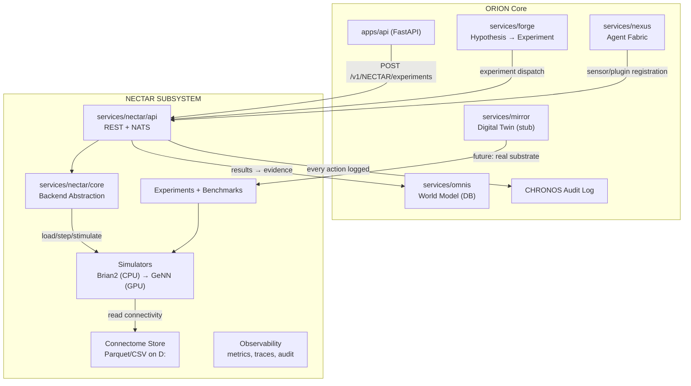
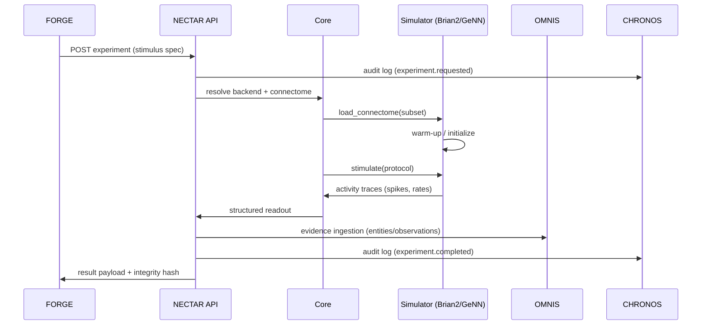

# NECTAR Integration Architecture

#architecture #nectar #integration

> How the Drosophila whole-brain simulation plugs into ORION as a specialized computational instrument. ORION remains orchestrator; fly brain is a measured, labeled subsystem — never conflated with ACI capability.

## Layer Model



## Data Flow



## Backend Abstraction

```python
class NectarBackend:
    """Any simulator must implement this contract."""
    name: str
    def load_connectome(self, path, constraints) -> None: ...
    def stimulate(self, neurons, pattern, duration) -> None: ...
    def step(self, dt) -> None: ...
    def readout(self, groups) -> dict: ...
    def checkpoint(self, path) -> None: ...
    def health(self) -> dict: ...
```

## Constraints (Safety-First)

1. NECTAR output is **evidence for OMNIS**, not autonomous action authority.
2. Every experiment has a **lifecycle trace** in CHRONOS — audit, not trust.
3. Readouts are **labeled by neuron group** — no "brain says" amalgamation.
4. All mocks labeled `MOCK` in output and telemetry.

## Storage Layout (D: drive)

```
D:\orion\data\\nectar\
  connectome\         # downloaded, versioned (v783)
  subsets\            # curated Phase-1 subsets
  results\            # raw traces + integrity hashes
  checkpoints\        # simulator state snapshots
```

## Sizing (Phase 1 — ≤25K neurons)

| Item | Budget |
|---|---|
| Connectome subset | 200-400 MB |
| Working RAM (Brian2) | ~2-3 GB |
| Runtime | minutes per 1s bio-time |
| GPU | not required Phase 1 (CPU proven) |