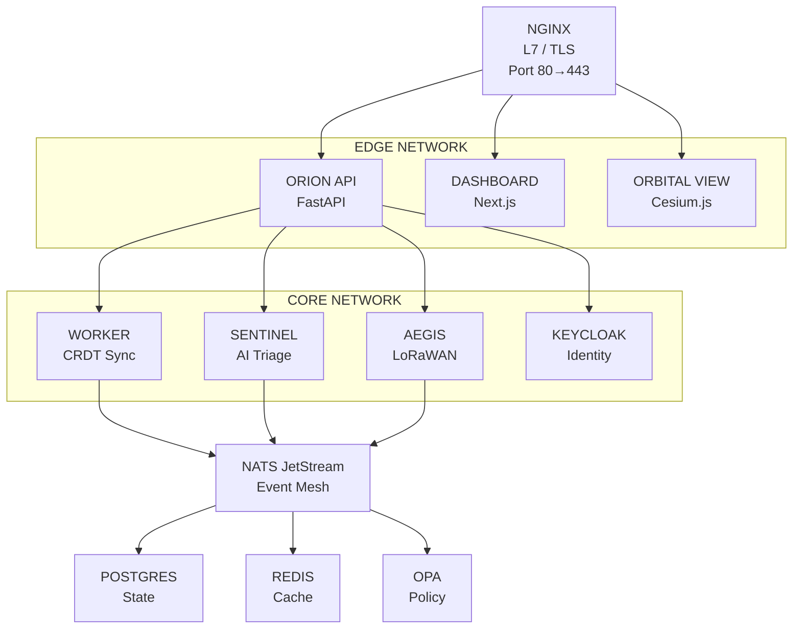
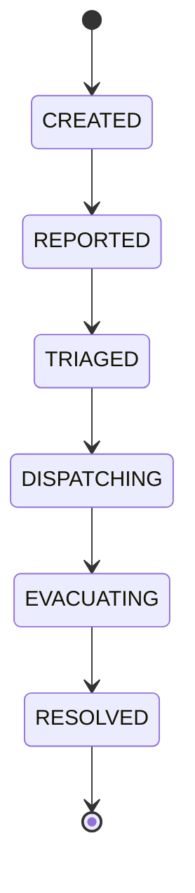

# System Architecture

#architecture #module

> Full system architecture of [[ORION]].

## High-Level Architecture

## Network Segmentation

| Network | Services | Purpose |
|---|---|---|
| **edge** | nginx, api, dashboard, orbital-view | Public-facing |
| **core** | worker, sentinel, aegis, postgres, redis, nats, keycloak, opa | Internal services |

## Request Flow

1. **Civilian SOS** → nginx → [[API Service|ORION API]] → validate JWT ([[Keycloak Identity\|Keycloak]]) → check OPA ([[OPA Policy Engine\|OPA]]) → create incident → publish to [[NATS Event Mesh\|NATS]] via outbox
2. **Hardware SOS** → [[AEGIS Gateway\|AEGIS]] → decode LoRaWAN/radio → HMAC verify → publish to NATS
3. **Worker** → subscribe NATS → dedup (Redis SETNX) → CRDT merge → [[ATLAS Infrastructure\|ATLAS GEO]] dispatch recommendation → store in PostgreSQL
4. **AI Sentinel** → subscribe `incident.created` → Ollama LLM triage → publish `incident.ai_triaged`
5. **Dashboard** → poll API → display on [[MIRROR Digital Twin\|MIRROR TWIN]] (Cesium globe)

## Incident Lifecycle

State only advances forward (CRDT Max-State). Never regresses.

## Related

- [[Tech Stack]]
- [[Docker Compose]]
- [[Kubernetes]]
- [[Zero Trust Architecture]]
- [[NATS Event Mesh]]
