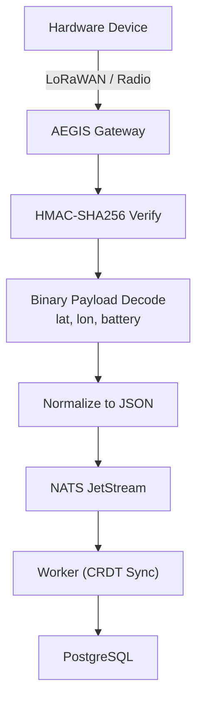

# AEGIS Gateway

#module #hardware #communications

> Hardware communications gateway for LoRaWAN and direct radio SOS signals.

## Purpose

AEGIS enables physical hardware devices to send emergency SOS signals even without cellular connectivity, using LoRaWAN and direct radio protocols.

## Capabilities

| Capability | Description |
|---|---|
| **LoRaWAN Ingress** | Decode LoRaWAN emergency packets |
| **Radio SOS** | Direct radio signal decoding |
| **HMAC Authentication** | SHA-256 device authentication |
| **Binary Payload Parsing** | Extract lat/lon/battery from binary data |
| **Normalized Adapters** | Unified format across protocols |
| **NATS Routing** | Publish decoded events to event mesh |

## Protocol Flow



## Payload Format

```json
{
  "device_id": "string",
  "lat": "float",
  "lon": "float",
  "battery": "int",
  "timestamp": "datetime",
  "hmac": "string",
  "protocol": "lorawan|radio"
}
```

## Current State

**Status: Functional**

The AEGIS service (`services/aegis/main.py`) provides:
- LoRaWAN packet decoding
- HMAC-SHA256 device authentication
- Binary payload parsing
- NATS event publishing

## Security

- Every device must present valid HMAC-SHA256 signature
- Invalid signatures are logged and rejected
- Device registry for authorized hardware

## Related

- [[ORION]]
- [[NATS Event Mesh]]
- [[Worker Service]]
- [[Zero Trust Architecture]]
- [[AEGIS Service]]
- [[AEGIS Gateway Runbook]]
