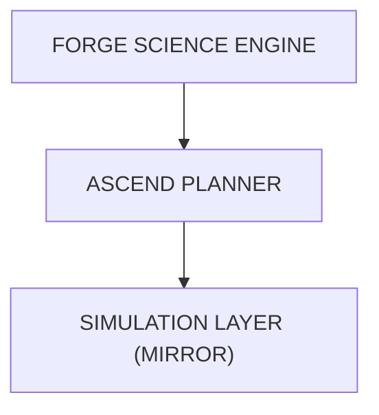

# ASCEND Planner

#module #ai #planning

> Long-horizon planner handling days to decades with uncertainty and replanning.

## Purpose

ASCEND handles planning across temporal scales: **days, months, years, and decades**. It decomposes long-term objectives into actionable milestones and adapts when reality deviates from predictions.

## Planner Capabilities

| Capability | Description |
|---|---|
| **Objectives & Constraints** | Define what to achieve and boundaries |
| **Milestones & Dependencies** | Break into ordered steps |
| **Resource Budgets** | Track resource consumption |
| **Risk & Uncertainty** | Quantify and plan for unknowns |
| **Alternative Strategies** | Generate backup plans |
| **Replanning & Recovery** | Adapt when things go wrong |
| **Progress Measurement** | Track actual vs planned |

## Example Objective

**"Reduce water stress by 30% within 10 years."**

```
10-year objective
  → 5-year objectives
    → 3-year objectives
      → Annual milestones
        → Quarterly actions
          → Measurable outcomes
```

## Replanning Loop

```
OBSERVE → MEASURE ERROR → UPDATE MODEL → REPLAN
```

> **Important**: Generating a long text plan is NOT long-horizon planning. ASCEND must track actual outcomes and correct course.

## Current State

**Status: Basic Implementation**

The ASCEND service (`services/ascend/planner.py`) provides:
- Multi-year objective decomposition
- Constraint identification
- Trajectory evaluation with replan triggers

### What's Planned
- Integration with [[OMNIS World Model|OMNIS]] for real-world state
- Monte Carlo simulation for uncertainty
- Resource allocation optimization
- Multi-stakeholder coordination

## Implementation

```python
# services/ascend/planner.py
class ASCENDPlanner:
    def decompose_objective(objective, timeline) → Milestones
    def evaluate_trajectory(milestones, current_state) → TrajectoryReport
    def check_replan_triggers(report) → ReplanNeeded
    def replan(original, trigger, new_state) → UpdatedPlan
```

## Architecture Position



## Related

- [[ORION]]
- [[FORGE Scientific Engine]]
- [[MIRROR Digital Twin]]
- [[OMNIS World Model]]
- [[ASCEND Service]]
