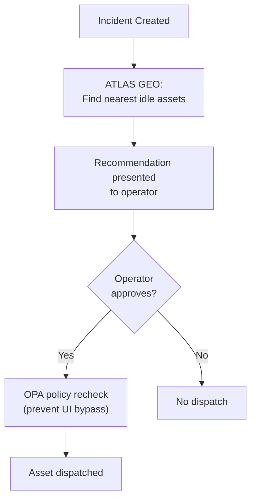

# ATLAS Infrastructure

#module #infrastructure #geospatial

> Cloud, edge, and geospatial infrastructure layer.

## Purpose

ATLAS provides the physical and spatial infrastructure for ORION, including cloud architecture, edge computing, and geospatial capabilities.

## ATLAS GEO

Geospatial dispatch engine for finding nearest emergency assets.

### Capabilities
- **703+ planetary nodes** procedurally seeded worldwide
- **Haversine distance** calculation for nearest-idle-asset
- **Human-in-the-loop** operator approval for dispatch
- **Asset state machine** with Optimistic Concurrency Control

### Asset Types
- Fire trucks
- Ambulances
- Police vehicles
- Medical teams
- Supply vehicles

### Dispatch Flow

## Infrastructure Components

| Component | Purpose |
|---|---|
| **Cloud Architecture** | Primary compute and storage |
| **Edge Architecture** | Local processing at incident sites |
| **Distributed Computing** | Multi-region deployment |
| **Container Orchestration** | [[Kubernetes]] production deployment |
| **Deployment Model** | Hybrid cloud/edge |

## Current State

**Status: Functional**

- 703+ assets seeded in PostgreSQL
- Haversine dispatch working
- Asset state machine with OCC implemented
- Pilot geofencing constraints active

## Related

- [[ORION]]
- [[Docker Compose]]
- [[Kubernetes]]
- [[Worker Service]]
- [[API Service]]
