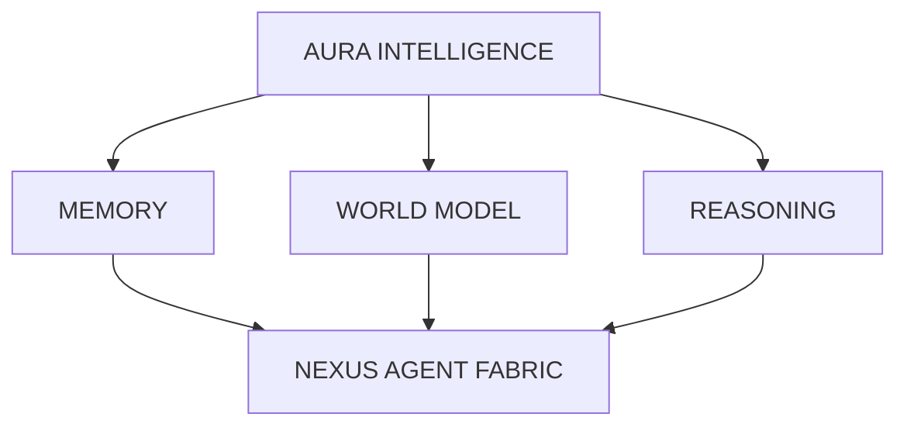

# AURA Intelligence

#module #ai

> The multimodal intelligence and reasoning core of [[ORION]].

## Purpose

AURA is the "brain" of the ACI architecture. It provides multimodal local reasoning capabilities, replacing the legacy SENTIENCE module.

## Responsibilities

- Multimodal input processing (text, images, sensor data)
- Reasoning and inference
- Decision support for [[NEXUS Agent Fabric|NEXUS]]
- Memory management for learned patterns
- Integration with [[OMNIS World Model|OMNIS]] for context

## Current State

**Status: Scaffolding**

The AI Sentinel (`services/ai_sentinel/`) provides basic LLM triage using Ollama (qwen2:0.5b), which is the precursor to AURA. Full AURA implementation is planned for Phase 2 of the [[ACI Roadmap Full|ACI Roadmap]].

### What Exists Now
- [[AI Sentinel]] - LLM-powered incident classification
- Deterministic fallback when LLM fails
- Severity extraction (LOW/MODERATE/HIGH/CRITICAL)
- Tag extraction from natural language

### What's Planned
- Multimodal reasoning (not just text)
- Local GPU inference (not just 0.5B models)
- Persistent memory across sessions
- Causal reasoning over [[OMNIS World Model|OMNIS]] entities

## Dependencies

- **Phase 1**: [[ORION]] core infrastructure
- **Requires**: Local GPU for production inference
- **Integrates with**: [[OMNIS World Model]], [[NEXUS Agent Fabric]]

## Architecture Position

## Related

- [[AI Sentinel]]
- [[ORION]]
- [[OMNIS World Model]]
- [[NEXUS Agent Fabric]]
- [[ACI Roadmap Full]]
