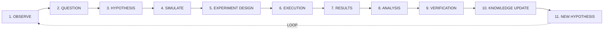
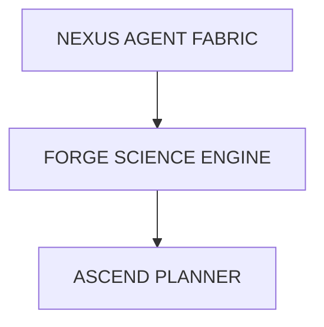

# FORGE Scientific Engine

#module #ai #research

> Scientific discovery and hypothesis generation engine.

## Purpose

FORGE operates a continuous scientific reasoning loop. It generates hypotheses, designs experiments, executes them (initially in simulation via [[MIRROR Digital Twin|MIRROR]]), evaluates results, and updates [[OMNIS World Model|OMNIS]].

> **Important**: Initial implementations will be entirely simulated. Autonomous scientific discovery will NOT be claimed until demonstrated.

## Target Architecture Loop



## Benchmark Tasks

- Hypothesis generation
- Experiment design
- Simulation execution
- Result interpretation
- Competing hypotheses
- Evidence evaluation

> Every scientific claim must have exact **provenance tracing** back to the raw data and the agent that generated the hypothesis.

## Current State

**Status: Basic Implementation**

The FORGE service (`services/forge/engine.py`) provides:
- Hypothesis → Experiment → Result → Evaluation pipeline
- OMNIS knowledge update when score >= 0.8
- Integration with MIRROR for simulation

### What's Planned
- Full simulation sandbox environments
- Competing hypothesis evaluation
- Automated experiment execution
- Literature review integration
- Peer review between agents

## Implementation

```python
# services/forge/engine.py
class FORGEEngine:
    def generate_hypothesis(omnis_state) → Hypothesis
    def design_experiment(hypothesis) → Experiment
    def execute(experiment, mirror) → Result
    def evaluate(result) → Evaluation
    def update_omnis(evaluation) → KnowledgeUpdate
```

## Architecture Position



## Related

- [[ORION]]
- [[NEXUS Agent Fabric]]
- [[MIRROR Digital Twin]]
- [[OMNIS World Model]]
- [[ASCEND Planner]]
- [[FORGE Service]]
