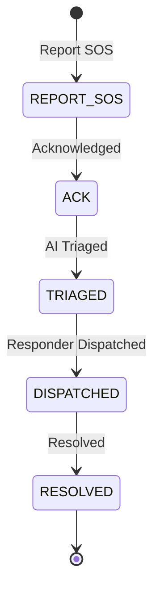

# HAVEN Platform

#module #civilian

> Civilian-facing platform for emergency SOS reporting.

## Purpose

HAVEN is the public interface where civilians can report emergencies and receive status updates. It's the frontend counterpart to the [[API Service|ORION API]] backend.

## Features

| Feature | Description |
|---|---|
| **SOS Reporting** | Submit emergency incidents via HTTP API |
| **Status Tracking** | Track incident lifecycle progress |
| **Real-time Updates** | Poll for dispatch and resolution status |
| **PII Protection** | Personal data masked before storage |

## Incident Lifecycle (from civilian perspective)

## API Endpoints

| Method | Endpoint | Description |
|---|---|---|
| `POST` | `/v1/incidents` | Create SOS incident |
| `GET` | `/v1/incidents/{id}` | Get incident status |
| `PATCH` | `/v1/incidents/{id}` | Update incident |

## Current State

**Status: API Complete, Frontend Pending**

- [[API Service|FastAPI backend]] fully functional
- Mobile app placeholder exists (`apps/mobile/`) but empty
- Dashboard is operator-facing, not civilian-facing

### What's Planned
- Dedicated civilian mobile app
- SMS-based SOS for low-connectivity areas
- Push notifications for status updates
- Community safety features

## PII Handling

All civilian messages pass through PII masking before storage:
- Email addresses redacted
- Phone numbers redacted
- SSN patterns redacted
- Uses regex engine in `apps/api/main.py`

## Related

- [[ORION]]
- [[API Service]]
- [[PII Masking]]
- [[AEGIS Gateway]]
