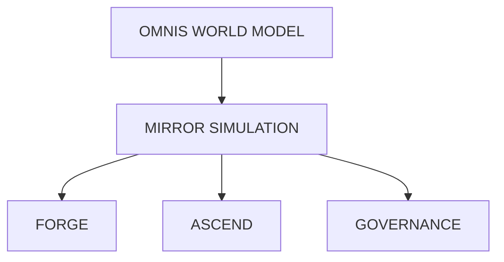

# MIRROR Digital Twin

#module #simulation

> Sandboxed simulation environment for safe testing and civilization modeling.

## Purpose

MIRROR provides a digital twin of the real world where synthetic events can be injected, scenarios can be tested, and outcomes can be evaluated without real-world consequences.

## Capabilities

| Capability | Description |
|---|---|
| **State Snapshot** | Capture [[OMNIS World Model\|OMNIS]] world state |
| **Event Injection** | Introduce synthetic events (disasters, policy changes) |
| **Tick-based Simulation** | Advance time in discrete steps |
| **Outcome Observation** | Track what happens in simulation |
| **Safe Testing** | Test policies before real-world deployment |

## Integration with Other Modules

- **Reads from**: [[OMNIS World Model|OMNIS]] (world state)
- **Feeds into**: [[FORGE Scientific Engine|FORGE]] (experiment execution)
- **Used by**: [[ASCEND Planner|ASCEND]] (plan evaluation)
- **Dashboard**: [[MIRROR Digital Twin|MIRROR TWIN]] operator view (Next.js + Cesium)

## Current State

**Status: Basic Implementation**

The MIRROR service (`services/mirror/engine.py`) provides:
- Initialize from OMNIS snapshot
- Inject synthetic events
- Advance tick-based simulation clock

### What's Planned
- Full agent behavior simulation
- Economic modeling
- Climate scenarios
- Infrastructure failure cascades
- Multi-year civilization simulation

## Implementation

```python
# services/mirror/engine.py
class MIRRORSimulator:
    def initialize(omnis_snapshot) → SimulationState
    def inject_event(event) → UpdatedState
    def advance_tick(state) → NewState
    def observe(state) → Observations
```

## MIRROR TWIN (Operator Dashboard)

The frontend dashboard (`apps/dashboard/`) is called MIRROR TWIN:
- **Next.js 16** + **React 19**
- **Cesium.js** 3D globe visualization
- Real-time asset tracking
- SOS ping animations
- Incident lifecycle management

## Architecture Position



## Related

- [[ORION]]
- [[OMNIS World Model]]
- [[FORGE Scientific Engine]]
- [[ASCEND Planner]]
- [[MIRROR Service]]
