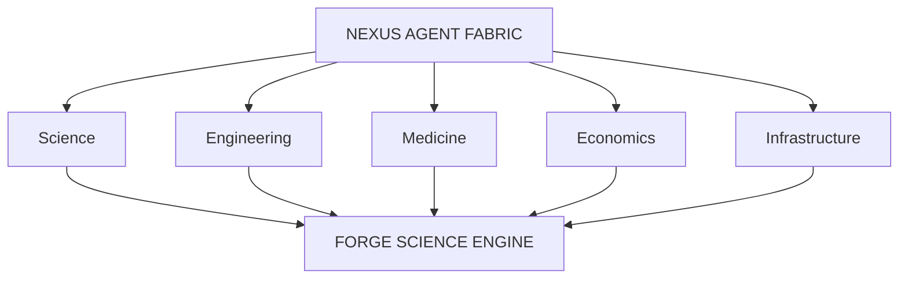

# NEXUS Agent Fabric

#module #ai #agents

> Multi-agent intelligence fabric for coordination, dispute resolution, and aggregation.

## Purpose

NEXUS coordinates specialized AI systems and humans. It operates on the principle that adding more agents does not automatically create intelligence; intelligence arises from **structured collaboration and error correction**.

## Core Features

| Feature | Description |
|---|---|
| **Agent Registration** | Agents register capabilities and availability |
| **Capability Discovery** | Find agents suited for specific tasks |
| **Task Delegation** | Assign tasks based on capability matching |
| **Hierarchical Planning** | Decompose complex tasks into subtasks |
| **Communication** | Inter-agent message passing |
| **Shared Memory** | Common context across agents |
| **Evidence Exchange** | Share data and reasoning |
| **Disagreement Resolution** | Handle conflicting conclusions |
| **Verification** | Cross-check agent outputs |
| **Result Aggregation** | Combine findings into coherent results |
| **Confidence Scoring** | Rate certainty of conclusions |
| **Human Escalation** | Route critical decisions to humans |

## Example Workflow: "Improve Regional Water Resilience"

1. **NEXUS decomposes**: Hydrology Agent + Climate Agent + Agriculture Agent + Energy Agent + Economic Agent + Infrastructure Agent + Policy Agent
2. Agents produce analyses and provide evidence
3. Agents identify uncertainty
4. Agents challenge contradictory conclusions
5. NEXUS reconciles disagreements
6. Agents produce candidate strategies
7. Strategies submitted for verification

## Current State

**Status: Basic Implementation**

The NEXUS service (`services/nexus/fabric.py`) provides:
- Agent registration
- Capability-based task delegation
- Dispute resolution

### What's Planned
- Full hierarchical task decomposition
- Shared memory across agents
- Evidence-based verification
- Confidence-weighted aggregation
- Human escalation workflows

## Implementation

```python
# services/nexus/fabric.py
class NexusFabric:
    def register_agent(agent_id, capabilities)
    def delegate_task(task) → assigned_agent_id
    def resolve_dispute(claim_a, claim_b) → resolution
```

## Architecture Position



## Related

- [[ORION]]
- [[AURA Intelligence]]
- [[OMNIS World Model]]
- [[FORGE Scientific Engine]]
- [[NEXUS Service]]
