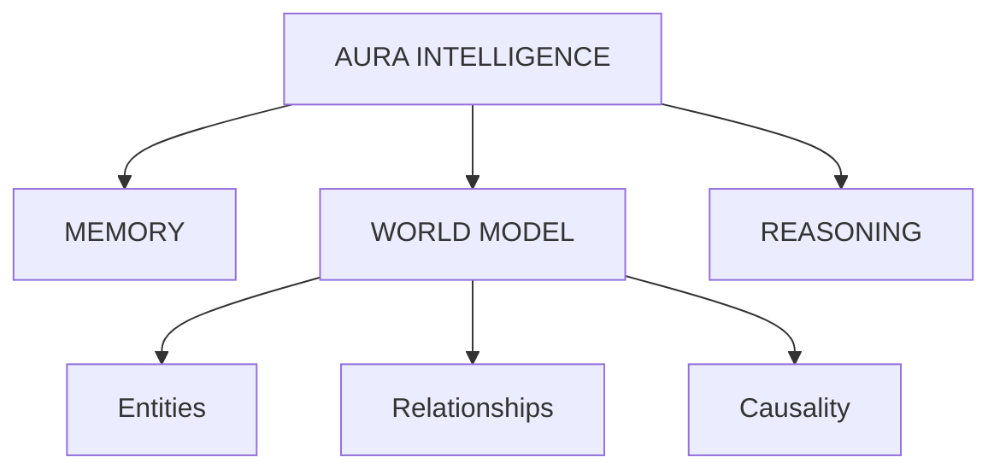

# OMNIS World Model

#module #ai #data

> The Civilization World Model - a structured, continuously updateable representation of civilization and its environment.

## Purpose

OMNIS is NOT just a giant database. It represents the interconnected web of civilization:

- **People, Organizations, Institutions, Cities**
- **Infrastructure, Energy, Water, Food, Transportation, Healthcare**
- **Economics, Technology, Science, Environment, Resources**
- **Communications, Space Infrastructure, Emergencies**

## Architectural Support

| Feature | Description |
|---|---|
| **Entities** | Nodes in the civilization graph |
| **Relationships** | Edges connecting entities |
| **Temporal State** | Historical, current, and projected future states |
| **Uncertainty** | Confidence scores for data points |
| **Provenance** | Lineage of every data point (which agent/sensor provided it) |
| **Causal Relationships** | Understanding that A affects B |
| **Events & Observations** | Telemetry and real-world occurrences |
| **Predictions & Dependencies** | Cascading effects |

## Example Causal Chain

```
DROUGHT → WATER AVAILABILITY → AGRICULTURE → FOOD SUPPLY
  → PRICES → MIGRATION → ENERGY DEMAND → INFRASTRUCTURE LOAD
```

## Current State

**Status: Scaffolding**

The basic data layer exists via PostgreSQL (entities/relationships) and the event fabric via [[NATS Event Mesh|NATS]]. Full graph-based OMNIS is planned for Phase 3 of the [[ACI Roadmap Full|ACI Roadmap]].

### What Exists Now
- PostgreSQL schema for incidents, assets, audit
- [[NATS Event Mesh|NATS]] event fabric for real-time updates
- [[ATLAS Infrastructure|ATLAS GEO]] spatial data (703+ planetary nodes)
- [[CHRONOS Audit|CHRONOS]] immutable event log

### What's Planned
- Graph database for entity-relationship modeling
- Causal inference engine
- Temporal reasoning (past → present → future)
- Confidence scoring for all data points
- Full provenance tracking

## Integration Points

- **Reads from**: [[AEGIS Gateway]], [[AI Sentinel]], [[API Service]], sensors
- **Writes to**: [[NEXUS Agent Fabric]], [[FORGE Scientific Engine]], [[ASCEND Planner]]
- **Updated by**: [[MIRROR Digital Twin]] simulation results

## Architecture Position



## Related

- [[ORION]]
- [[AURA Intelligence]]
- [[NEXUS Agent Fabric]]
- [[FORGE Scientific Engine]]
- [[MIRROR Digital Twin]]
