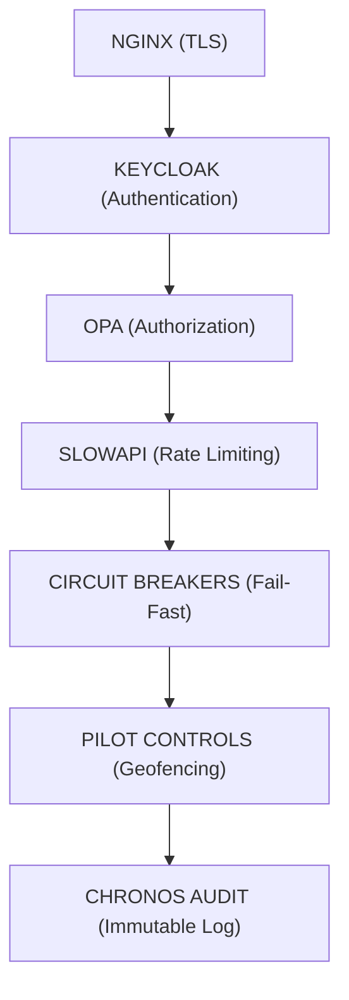

# VEIL Security

#module #security

> Zero-trust governance and security layer controlling all real-world interactions.

## Purpose

VEIL ensures that every action in ORION is authenticated, authorized, and audited. No implicit trust is granted to any component, network, or user.

## Security Layers

## Components

### [[Keycloak Identity]]
- OpenID Connect provider
- JWT/JWKS token verification
- Role-based access (citizen, operator)

### [[OPA Policy Engine]]
- Rego policy evaluation
- Per-request authorization
- Default deny with explicit allow

### [[Break Glass Protocol]]
- Emergency override for catastrophic failures
- 15-minute elevated token
- Fully audited

### Rate Limiting
- Per-principal (authenticated user) token buckets
- SlowAPI implementation

### Circuit Breakers
- Redis-backed distributed circuit breakers
- For OPA and Keycloak
- Fail-fast after 5 consecutive failures
- 30-second cooldown

### [[PII Masking]]
- Automated redaction of emails, phones, SSNs
- Applied before storage

## Current State

**Status: Production-Grade**

- Zero-trust verified across all endpoints
- Break-glass tested (3/3 HITL safety suite passed)
- Circuit breakers functional
- Rate limiting active

## Threat Model

See `docs/cyber/threat-model.md` for full STRIDE analysis.

## Related

- [[ORION]]
- [[Zero Trust Architecture]]
- [[Keycloak Identity]]
- [[OPA Policy Engine]]
- [[Break Glass Protocol]]
- [[FORGE CYBER]]
