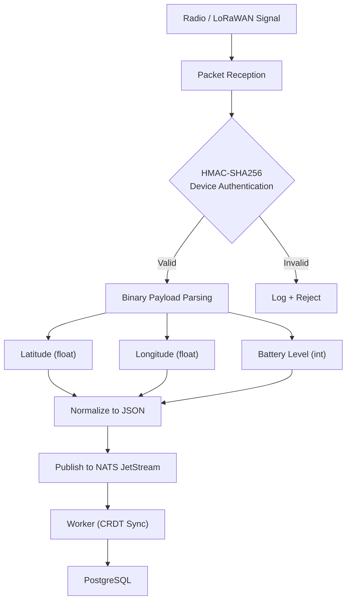

# AEGIS Service

#service #hardware #communications

> LoRaWAN and direct radio SOS decoding gateway.

## Location

`services/aegis/main.py` (148 lines)

## Protocols

| Protocol | Use Case |
|---|---|
| **LoRaWAN** | Long-range, low-power emergency packets |
| **Direct Radio** | Short-range radio SOS signals |

## Processing Pipeline

## Security

- Every packet must have valid HMAC-SHA256 signature
- Device registry for authorized hardware
- Invalid signatures logged in [[CHRONOS Audit|CHRONOS]]

## Related

- [[ORION]]
- [[AEGIS Gateway]]
- [[NATS Event Mesh]]
- [[Worker Service]]
