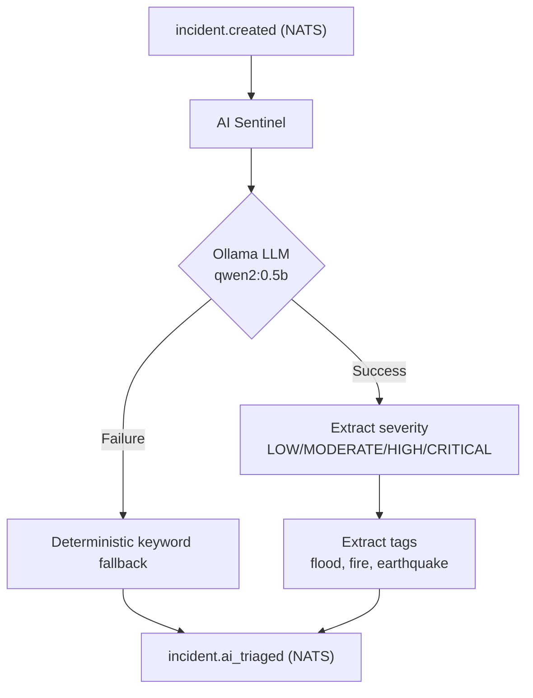

# AI Sentinel

#service #ai #triage

> LLM-powered incident triage via Ollama with deterministic fallback.

## Location

`services/ai_sentinel/main.py` (127 lines)

## How It Works

## LLM Configuration

| Setting | Value |
|---|---|
| **Model** | qwen2:0.5b |
| **Runtime** | Ollama (host-side) |
| **Input** | SOS message text |
| **Output** | Severity + tags JSON |

## Fallback Logic

When Ollama is unavailable or returns invalid output:
- Keyword matching for severity classification
- Pattern matching for tag extraction
- Deterministic, no AI dependency

## Current State

**Status: Functional**

- LLM triage working with qwen2:0.5b
- Fallback tested
- Integrated into NATS event flow

### Limitations
- 0.5B parameter model (toy level)
- Text-only (no multimodal)
- No persistent memory

### Future (→ [[AURA Intelligence|AURA]])
- Larger local models (7B+)
- Multimodal input (images, sensor data)
- Persistent reasoning memory
- Causal analysis

## Related

- [[ORION]]
- [[AURA Intelligence]]
- [[NATS Event Mesh]]
- [[API Service]]
