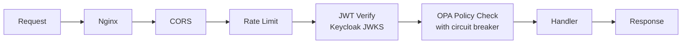

# API Service

#service #backend

> FastAPI core application - the primary HTTP interface for [[ORION]].

## Location

`apps/api/main.py` (887 lines)

## Tech Stack

- **FastAPI** 0.110.0 + **Uvicorn**
- **SQLAlchemy** 2.0.28 + **PostgreSQL** 15
- **PyJWT** + **cryptography** for JWT handling
- **httpx** for async HTTP (OPA, Keycloak, Ollama)
- **SlowAPI** for rate limiting
- **Tenacity** for retries

## API Endpoints

| Method | Endpoint | Auth | Description |
|---|---|---|---|
| `POST` | `/v1/incidents` | Citizen | Create SOS incident |
| `GET` | `/v1/incidents/{id}` | Operator | Get incident |
| `PATCH` | `/v1/incidents/{id}` | Operator | Update incident status |
| `GET` | `/v1/assets` | Operator | List responder assets |
| `POST` | `/v1/dispatch/recommend` | Operator | Get dispatch recommendation |
| `POST` | `/v1/dispatch/approve` | Operator | Approve dispatch (HITL) |
| `POST` | `/v1/break-glass` | Operator | Emergency override |
| `POST` | `/v1/pilot/kill-switch` | Operator | Suspend operations |
| `GET` | `/health` | None | Health check |

## Security Pipeline

Every request passes through:

### Circuit Breakers
- **OPA**: Fail-fast after 5 failures, 30s cooldown
- **Keycloak**: Fail-fast after 5 failures, 30s cooldown

### Break-Glass Protocol
- Operator can bypass OPA with elevated token
- Token valid for 15 minutes
- Fully audited in [[CHRONOS Audit|CHRONOS]]

## Outbox Pattern

Transaction outbox ensures exactly-once [[NATS Event Mesh|NATS]] publishing:
1. Incident created in PostgreSQL + outbox entry (same transaction)
2. Background publisher reads outbox → publishes to NATS
3. Entry marked as published

## Pilot Controls

- **Geofencing**: All incidents constrained to configured bounding box
- **Kill Switch**: Redis-backed instant operation suspension

## Middleware Stack

1. CORS (configurable origins)
2. Request ID generation
3. Rate limiting (per-principal)
4. OpenTelemetry tracing
5. [[CHRONOS Audit|CHRONOS]] audit logging

## Related

- [[ORION]]
- [[System Architecture]]
- [[Keycloak Identity]]
- [[OPA Policy Engine]]
- [[NATS Event Mesh]]
- [[Worker Service]]
