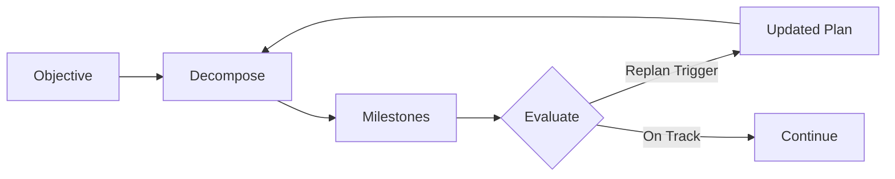

# ASCEND Service

#service #ai #planning

> Runtime for the [[ASCEND Planner]] long-horizon planning engine.

## Location

`services/ascend/planner.py` (75 lines)

## Pipeline

## Current State

**Status: Basic Implementation**

- Multi-year objective decomposition
- Constraint identification
- Trajectory evaluation with replan triggers

## Related

- [[ASCEND Planner]]
- [[FORGE Scientific Engine]]
- [[MIRROR Digital Twin]]
- [[ORION]]
