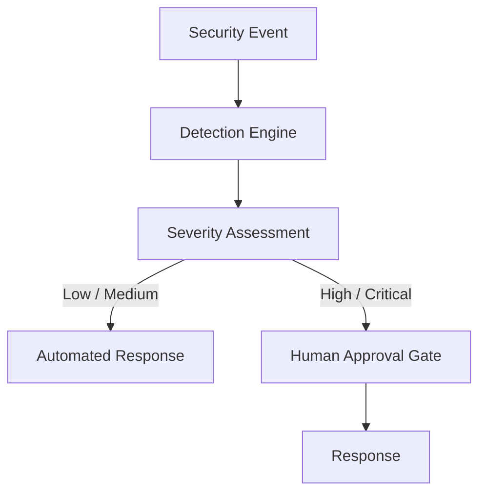

# Cyber Service

#service #security

> [[FORGE CYBER]] detection engine and SOAR runtime.

## Location

`services/cyber/` (5 files)

## File Structure

| File | Lines | Purpose |
|---|---|---|
| `__init__.py` | 9 | Re-exports |
| `oses.py` | 92 | SecurityEvent schema, Actor, haversine_km |
| `emitter.py` | 40 | JSONL event emitter (no-op by default) |
| `detections.py` | 286 | 11-rule detection engine |
| `soar.py` | 192 | SOAR engine with HITL approval |

## Detection Rules

1. Brute force (repeated auth failures)
2. Impossible travel (geo-distant same-user auth)
3. Break-glass anomaly (unusual patterns)
4. Kill-switch tamper (unauthorized modifications)
5. NATS unauthorized publisher
6. Payload oversize
7. Asset teleport (distant simultaneous presence)
8. Policy deny burst
9. Session anomaly
10. Rate limit abuse
11. Audit tamper

## SOAR Flow

## Current State

**Status: Functional (Phase 2)**

- 25/25 unit tests green
- Event emitter wired to auth failures, break-glass, OPA denials
- JSONL sink when `FORGE_CYBER_EVENTS` is set

## Related

- [[FORGE CYBER]]
- [[VEIL Security]]
- [[ORION]]
