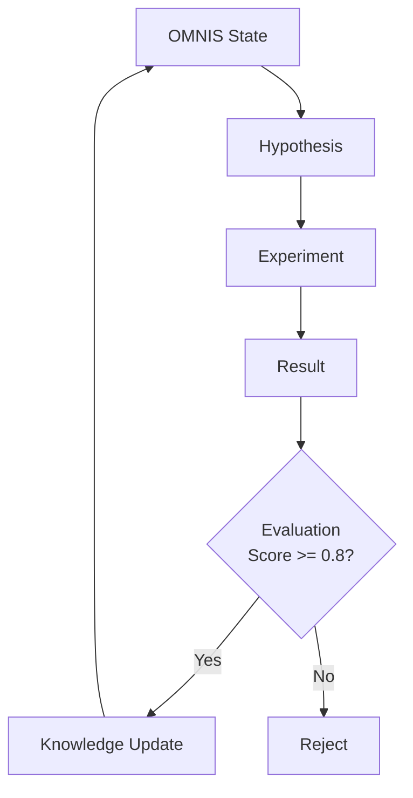

# FORGE Service

#service #ai #research

> Runtime for the [[FORGE Scientific Engine]].

## Location

`services/forge/engine.py` (71 lines)

## Pipeline

## Current State

**Status: Basic Implementation**

- Hypothesis generation from OMNIS state
- Experiment design
- Result evaluation
- OMNIS knowledge update (threshold: 0.8)

## Related

- [[FORGE Scientific Engine]]
- [[MIRROR Digital Twin]]
- [[OMNIS World Model]]
- [[ORION]]
