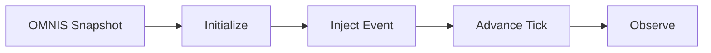

# MIRROR Service

#service #simulation

> Runtime for the [[MIRROR Digital Twin]] simulation engine.

## Location

`services/mirror/engine.py` (71 lines)

## Pipeline

## Current State

**Status: Basic Implementation**

- Initialize from OMNIS snapshot
- Inject synthetic events
- Advance tick-based simulation clock

## Related

- [[MIRROR Digital Twin]]
- [[FORGE Scientific Engine]]
- [[OMNIS World Model]]
- [[ORION]]
