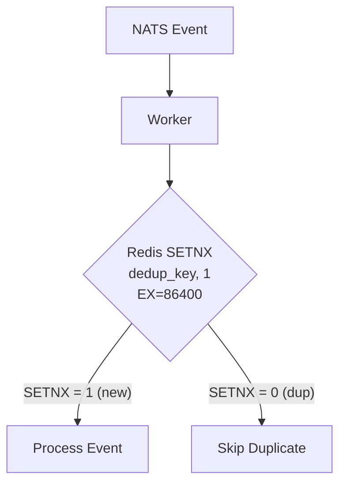

# Worker Service

#service #backend #crdt

> Background worker for CRDT synchronization, event projection, and [[ATLAS Infrastructure|ATLAS GEO]] dispatch.

## Location

`services/worker/main.py` (244 lines)

## Responsibilities

| Responsibility | Description |
|---|---|
| **CRDT Sync** | Max-State merge for offline/edge events |
| **Deduplication** | Redis SETNX atomic dedup (24h TTL) |
| **Event Projection** | NATS events → PostgreSQL state |
| **ATLAS GEO** | Haversine nearest-idle-asset dispatch |
| **PATHFINDER** | Network handler for edge devices |
| **Metrics** | Prometheus metrics (latency, duplicates, successes) |

## CRDT Semantics

**Max-State CRDT**: Incident status only advances forward, never regresses.

```
REPORTED → TRIAGED → DISPATCHING → EVACUATING → RESOLVED
```

If two workers receive conflicting updates, the higher-status wins deterministically.

## Deduplication Flow



## Dispatch Algorithm

```python
def find_nearest_idle_asset(incident_lat, incident_lon, asset_type):
    idle_assets = query(Asset, status="IDLE", type=asset_type)
    distances = [(a, haversine(incident, a)) for a in idle_assets]
    nearest = min(distances, key=lambda x: x[1])
    return nearest  # Presented to operator for HITL approval
```

## Prometheus Metrics

| Metric | Description |
|---|---|
| `worker_event_latency_seconds` | Processing time per event |
| `worker_duplicates_total` | Duplicate events skipped |
| `worker_successes_total` | Successfully processed events |

## Current State

**Status: Functional**

- JetStream subscriber working
- Redis dedup verified
- Haversine dispatch verified
- CRDT merge verified under chaos simulation

## Related

- [[ORION]]
- [[PHOENIX Resilience]]
- [[NATS Event Mesh]]
- [[Redis]]
- [[ATLAS Infrastructure]]
- [[API Service]]
