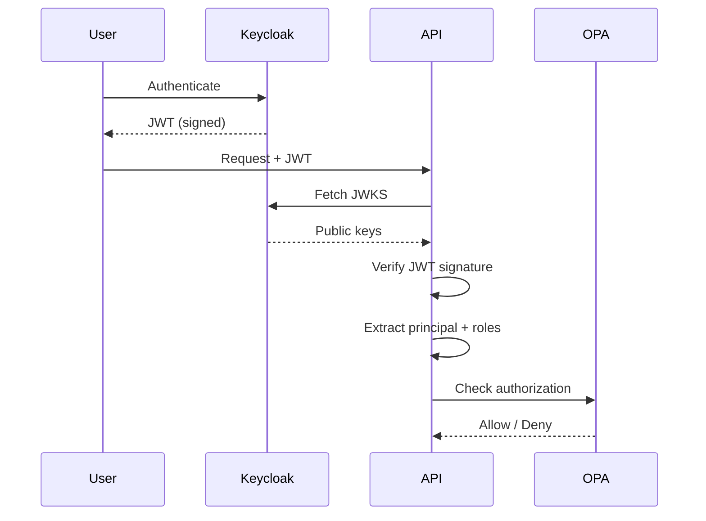

# Keycloak Identity

#security #identity

> OpenID Connect identity provider for ORION.

## Purpose

Keycloak handles authentication and identity management. It issues JWT tokens that are verified by the [[API Service]] on every request.

## Configuration

| Setting | Value |
|---|---|
| **Version** | 23.0 |
| **Protocol** | OpenID Connect |
| **Token Type** | JWT |
| **Verification** | JWKS endpoint |

## Roles

| Role | Permissions |
|---|---|
| **citizen** | Create SOS incidents, read own incidents |
| **operator** | Full CRUD, dispatch, break-glass, pilot controls |

## JWT Flow

## Circuit Breaker

- Fail-fast after 5 consecutive JWKS fetch failures
- 30-second cooldown
- Redis-backed state

## Related

- [[VEIL Security]]
- [[Zero Trust Architecture]]
- [[OPA Policy Engine]]
- [[API Service]]
