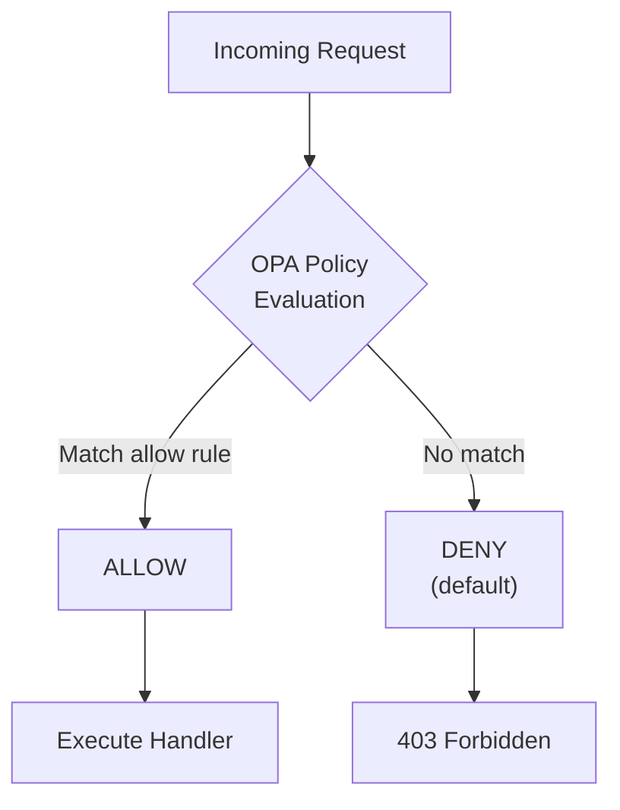

# OPA Policy Engine

#security #policy

> Open Policy Agent for authorization decisions.

## Purpose

OPA evaluates authorization policies written in Rego. Every API request (except health checks) passes through OPA for allow/deny decisions.

## Default Policy: Deny

All policies default to **deny**. Access is only granted by explicit allow rules.



## Policy Rules

### `policy/opa/policy.rego` - API Authorization

```
package orion.authz

default allow = false

# Citizens can create SOS incidents
allow {
    input.method == "POST"
    input.path == "/v1/incidents"
    input.roles[_] == "citizen"
}

# Operators get full access
allow {
    input.roles[_] == "operator"
}
```

### `policy/opa/system_authz.rego` - System Authorization

```
package system.authz

default allow = false

# Allow policy evaluation
allow {
    input.method == "POST"
    startswith(input.path, "/v1/data/")
}

# Allow policy reads
allow {
    input.method == "GET"
}
```

## Integration with Break-Glass

During [[Break Glass Protocol|break-glass]] events, OPA can be bypassed with an elevated token. This bypass is fully audited.

## Circuit Breaker

- Fail-fast after 5 consecutive failures
- 30-second cooldown
- Redis-backed state
- API returns 503 if OPA is unreachable

## Related

- [[VEIL Security]]
- [[Zero Trust Architecture]]
- [[Keycloak Identity]]
- [[Break Glass Protocol]]
- [[API Service]]
