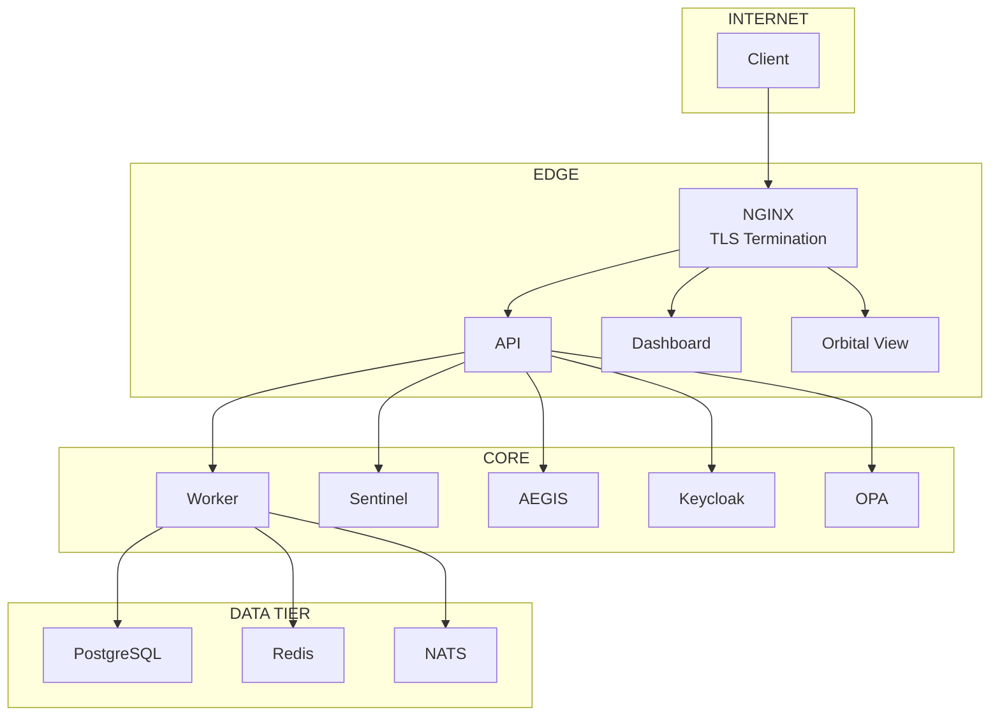
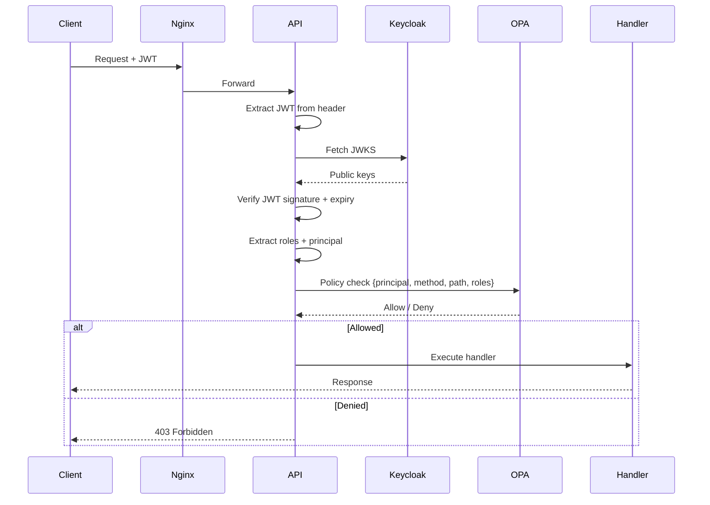

# Zero Trust Architecture

#security #architecture

> Every request is authenticated, authorized, and audited. No implicit trust.

## Principles

1. **Never trust, always verify** - Every request authenticated
2. **Least privilege** - Minimal permissions granted
3. **Assume breach** - Design for compromise detection
4. **Micro-segmentation** - Network isolation between services

## Trust Boundaries

## Authentication Flow

## Related

- [[VEIL Security]]
- [[Keycloak Identity]]
- [[OPA Policy Engine]]
- [[Break Glass Protocol]]
- [[FORGE CYBER]]
