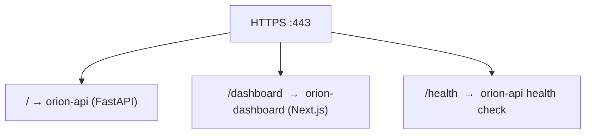

# Nginx Edge

#infrastructure #proxy

> L7 reverse proxy for TLS termination and load balancing.

## Purpose

Nginx is the single entry point for all external traffic. It handles TLS, rate limiting, and routes to internal services.

## Configuration

| Setting | Value |
|---|---|
| **HTTP Port** | 80 (redirects to 443) |
| **HTTPS Port** | 443 |
| **TLS** | Self-signed certs for pilot |
| **Load Balancing** | Round-robin to API replicas |

## Routing

## ASCEND GSLB

ASCEND provides Layer 7 Global Server Load Balancing through Nginx configuration.

## Related

- [[System Architecture]]
- [[Docker Compose]]
- [[Kubernetes]]
- [[Zero Trust Architecture]]
